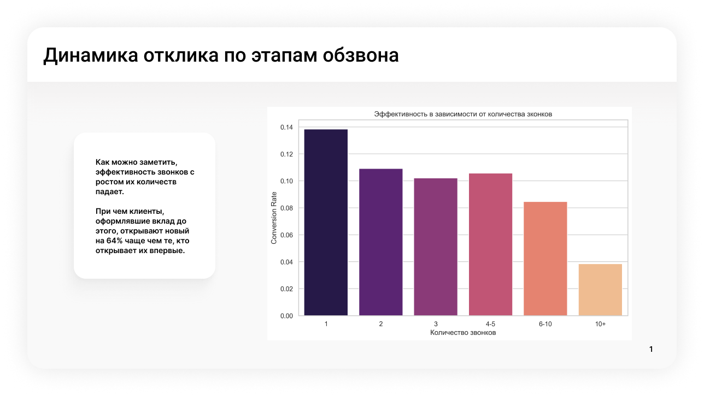
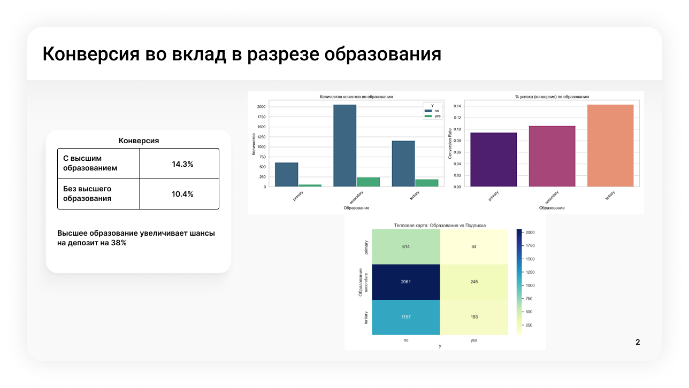
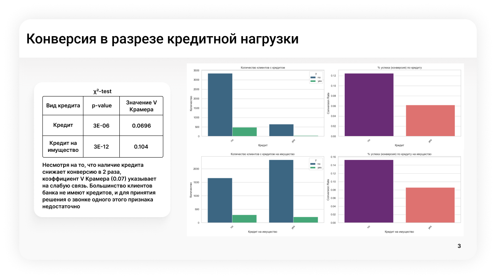
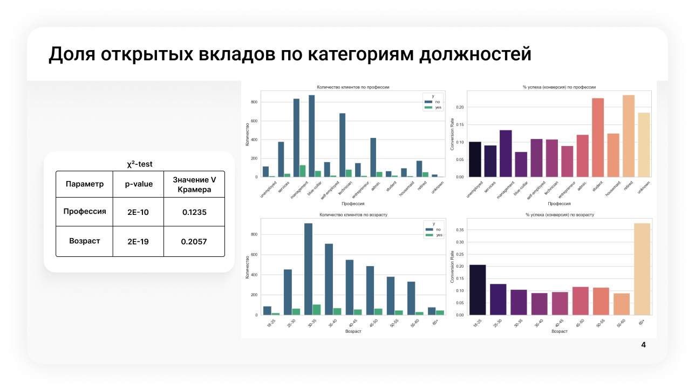
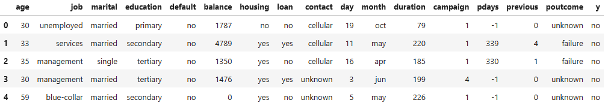

# Bank-data-analysis
В данной работе представлен пет проект по аналитике данных банка с использованием Python и статистических методов.

Ссылка на датасет - https://archive.ics.uci.edu/dataset/222/bank+marketing

Датасет:
Португальский банк с мая 2008 года по февраль 2010 года проводил ряд обзвонов по свои клиентам с предложениями об открытии вклада. Решение клиента открыть вклад или не открыть записано в колонке 'y'. Также предоставлена информация об образовании клиентов, их возрасте, семейном положении, профессии, наличии кредита, истории звонков от банка и оформлял ли клиент вклад до этого.

Задача:
Изучить корреляцию различных данных о клиенте с его решением открыть вклад или нет. Построить графики конверсии и провести тесты с помощью статистических методов подтверждая гипотезы о зависимости или отклоняя их.
В проекте используется тест хи-квадрат (уровень значимости - 0.05), для количественной оценки силы и значимости связи между двумя категориальными переменными используется коэффициент V Крамера, а также используется метод доверительных интервалов.

Польза:
С помощью изучения этих данных можно понять стратегию работы с клиентами в будущем. Каким клиентам стоит предлагать открытие вклада в первую очередь из-за большой вероятности успеха, а кто скорее всего откажется.

Результат:
1. Исследование динамики отклика клиентов в зависимости от интенсивности обзвона, а также влияние того, открывал ли клиент вклад уже до этого.
   

2. Анализ влияния образовательного ценза на склонность к открытию депозита.
   
3. Оценка статистической значимости влияния кредитных обязательств на склонность к открытию депозита.
   
4. Анализ распределения целевой переменной в разрезе профессиональной деятельности.
   
Ход работы:
1. Считываем датасет
   ```python
   df = pd.read_csv(r'C:\Users\Vlad\Downloads\bank.csv', sep=';')
   df.head()
   ```
   
2. Создаем функцию для построения графиков
   <details>
   <summary>Гистограмма + гистограмма с конверсией по оси y</summary>
      
   ```python
   def plot_smart_bar(column, dataframe):
       plt.figure(figsize=(16, 5))
       # 1. График количества (Count Plot)
       plt.subplot(1, 2, 1)
       sns.countplot(data=dataframe, x=column, hue='y', palette='viridis')
       if column == 'age_group':
           plt.title('Количество клиентов по возрасту')
       elif column == 'education':
           plt.title('Количество клиентов по образованию')
       elif column == 'loan':
           plt.title('Количество клиентов с кредитом')
       elif column == 'housing':
           plt.title('Количество клиентов с кредитом на имущество')
       elif column == 'job':
           plt.title('Количество клиентов по профессии')
       else:
           plt.title(f'Количество клиентов по {column}')
       plt.ylabel('Количество')
       if column == 'age_group':
           plt.xlabel('Возраст')
       elif column == 'education':
           plt.xlabel('Образование')
       elif column == 'loan':
           plt.xlabel('Кредит')
       elif column == 'housing':
           plt.xlabel('Кредит на имущество')
       elif column == 'job':
           plt.xlabel('Профессия')
       plt.xticks(rotation=45)
   
       # 2. График вероятности (Conversion Rate)
       plt.subplot(1, 2, 2)
       temp_df = dataframe.copy()
       temp_df['y_numeric'] = temp_df['y'].map({'yes': 1, 'no': 0})
       
       sns.barplot(data=temp_df, x=column, y='y_numeric', palette='magma', errorbar=None)
       if column == 'age_group':
           plt.title('% успеха (конверсия) по возрасту')
       elif column == 'education':
           plt.title('% успеха (конверсия) по образованию')
       elif column == 'loan':
           plt.title('% успеха (конверсия) по кредиту')
       elif column == 'housing':
           plt.title('% успеха (конверсия) по кредиту на имущество')
       elif column == 'job':
           plt.title('% успеха (конверсия) по профессии')
       else:
           plt.title(f'% успеха (конверсия) по {column}')
       plt.ylabel('Conversion Rate')
       plt.xticks(rotation=45)
   
       plt.tight_layout()
       if column == 'age_group':
           plt.xlabel('Возраст')
       elif column == 'education':
           plt.xlabel('Образование')
       elif column == 'loan':
           plt.xlabel('Кредит')
       elif column == 'housing':
           plt.xlabel('Кредит на имущество')
       elif column == 'job':
           plt.xlabel('Профессия')
       plt.savefig(f'{column}.png')
       plt.show()
   ```
   </details>
3. Функция для теста Хи-квадрат с построением тепловой карты. Считаем уровень значимости равным 0.05, значит если p_value < 0.05, то мы отвергаем гипотезу $H_0$ и принимаем альтернативную - $H_1$
   <details>
   <summary>Тест Хи-квадрат + тепловая карта</summary>
      
   ```python
   def chi2_test(column, target_column, df):
       contingency_table = pd.crosstab(df[column], df[target_column])
       chi2, p_val, dof, expected = stats.chi2_contingency(contingency_table)
   
       print(f"Chi-square p-value: {p_val}")
       if p_val < 0.05:
           print("Есть зависимость")
       else:
           print("Переменные независимы")
   
       plt.figure(figsize=(8, 5))
       sns.heatmap(contingency_table, annot=True, fmt='d', cmap='YlGnBu')
       plt.title(f'Тепловая карта: {column} vs {target_column}')
       plt.ylabel(f'{column}')
       plt.savefig(f'heat_map_{column}.png')
       plt.show()
   ```
   </details>
4. Рассчет коэффициента V Крамера
   <details>
   <summary>Тест Хи-квадрат + тепловая карта</summary>
      
   ```python
   def cramers_v(column, target_column, dataframe):
       # 1. Строим таблицу сопряженности
       conf_matrix = pd.crosstab(dataframe[column], dataframe[target_column])
       
       # 2. Считаем Хи-квадрат
       chi2 = chi2_contingency(conf_matrix)[0]
       
       # 3. Параметры расчета
       n = conf_matrix.sum().sum() # Общее кол-во наблюдений
       phi2 = chi2 / n
       r, k = conf_matrix.shape
       
       # Формула V Крамера
       # Результат всегда от 0 (нет связи) до 1 (полная зависимость)
       result = np.sqrt(phi2 / min(k - 1, r - 1))
       return result
   ```
   </details>
